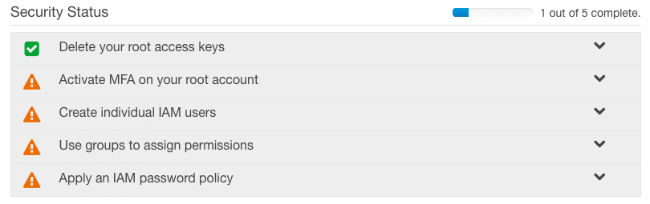

# IAM

## Quick Summary

| Front | Back |
| :--- | :--- |
| IAM stands for? | Identification and Access Management |
| IAM is commonly used for managing? | Users, Groups, Roles, Access Policies |
| Which permissions are granted to root user? | Everything |
| Which permissions are granted to a new user? \(besides root user\) | Nothing |

## IAM Best Practices

* Multi-Factor Authentication
* Create an Admin IAM User and Group
* Use groups to assign permissions
* IAM password policy

## IAM Users and Policies



User and Policy

Group and Policy

Role















