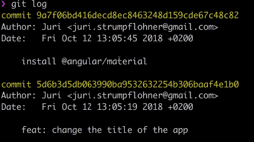

# Git

{% embed url="https://egghead.io/courses/productive-git-for-developers?utm\_content=productive-git-for-developers&amp%3Butm\_medium=email&amp%3Butm\_source=drip&amp%3Butm\_term=git&utm\_medium=email" caption="" %}

### Commit only some

```bash
> git add src/app/app.component.ts src/app/app.component.html

# or

> git add src/app/app.component.*
```

### git log

* **shows you commit log, so, we can jump directly**
* **shows you when and who authored** 
* **shows you commit message**



### git alias

 You can configure git alias in `~/.gitconfig`

DAMN - This is paid subsriber's course at around $40/month

* will try after I finish Material and React Official courses


